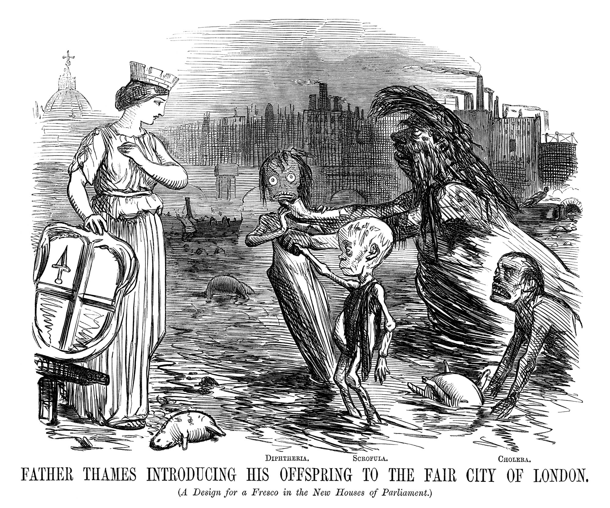
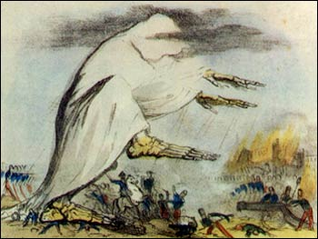
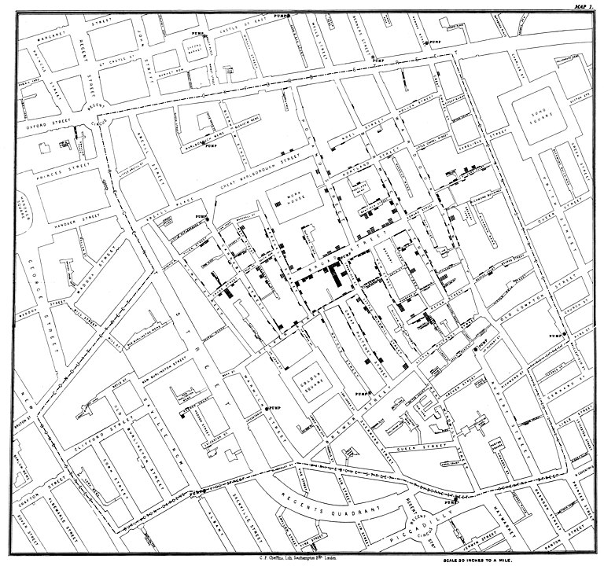
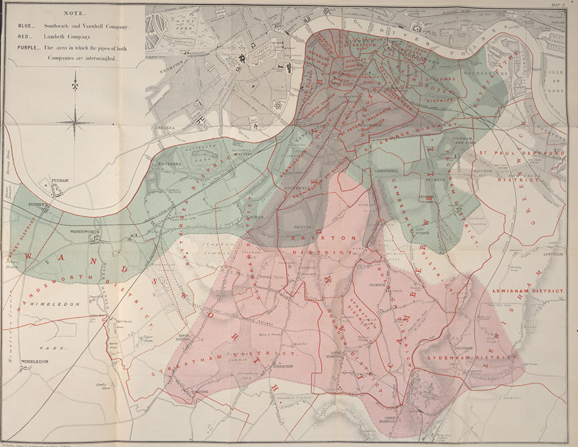

# Instrumental Variables {#sec-iv}

```{r}
#| echo: false
#| message: false
#| warning: false
library(modelsummary)
library(ggplot2)
gm = modelsummary::gof_map
gm$omit <- TRUE
gm$omit[gm$clean == "R2"] <- FALSE
gm$omit[gm$clean == "Num.Obs."] <- FALSE
gom = "p.value.|se_type|statistic.end|statistic.overid|statistic.weakinst"
```

In the previous chapters we have seen how to get credible causal estimates for the effect of some intervention via randomization techniques. Randomly allocating a subject to treatment or control groups makes sure that *everything else is equal*, hence we are really comparing apples with apples. Unfortunately, oftentimes we cannot perform a randomized control trial (RCT), out of technological, ethical, or other constraints. (We mentioned that forcing people to smoke via lottery draw is impossible to justify.)

So, that's it, no RCT, no causal estimates?

No! Methods like instrumental variables can help us to establish causality if we only have *observational data* (i.e. data generated not via experiment). That's reassuring, because in many settings this kind of data is the only thing we have.


## John Snow and the London Cholera Epidemic


```{r}
#| label: fig-father-thames
#| echo: false
#| fig-cap: "Father Thames Introducing his Offspring to the Fair City of London, [Punch (1858)](https://www.bl.uk/collection-items/father-thames-introducing-his-offspring-to-the-fair-city-of-london-from-punch)"

```

The 1853-1854 Cholera outbreak in London killed 616 people. Physician [John Snow](https://en.wikipedia.org/wiki/John_Snow) was able to use data collected during this period to demonstrate that the illness was water-borne, and not transmitted via air, as was widely believed at the time. In order to better appreciate this section, let's imagine the world of John Snow in 1853^[The following is based on @freedman1991]:

::: {.callout-note}
* It is not yet known that germs can cause disease (or indeed, that they exist).
* Microscopes exist, but work at rather poor resolution.
* Most human pathogens are not visible to the naked eye, and the isolation of such microbes is still several decades away.
* The so-called *infection theory* (i.e. infection via *germs*) has some supporters, but the dominant idea is that disease, in general, results from [*miasmas*](https://en.wikipedia.org/wiki/Miasma_theory): very small, non-living poisonous particles that float in the air - basically rotting organic matter would emanate foul air, that caused disease. The figure below shows an illustration.
:::

```{r}
#| label: fig-miasma
#| echo: false
#| dpi: 75
#| fig-cap: "Miasma in the Air. Robert Seymour - A Short History of the National Institutes of Health National Library of Medicine photographic archive."

```


Snow hypothesized that the pathogen causing cholera was taken into the body via food or drink, multiplied and generated a poisonous substance causing the body to expel water, i.e. an extreme form of diarrhea. The active agent then would leave the human body via those excrements, and find their way back into the water supply, infecting the next victim. So, the question at the time was: is cholera a result of *miasmas* (foul, poisonous air), or a pathogen that was water-borne and infected new victims via excrements of former victims (the *infection theory*)?

Snow conducted some impressive detective work tracking down exceptional cases that would refute the miasma theory. For example he documented that two adjacent appartment buildings, one hit by cholera and the other not, had different water supplies: the first building's supply was contaminated by runoffs from privies (toilets), while the second one had arguably cleaner water. He studied the wider water supply system of London, finding that several water providers took their water from the heavily polluted River Thames.

During 1853-1854, John Snow drew a map (see @fig-snow-map) that showed where the fatalities had occured. It became obvious that the cases clustered around the Broad Street pump.

```{r}
#| label: fig-snow-map
#| echo: false
#| fig-cap: "John Snow's original map of the Broad Street pump. https://commons.wikimedia.org/wiki/File:Snow-cholera-map-1.jpg"

```

The history goes that after observing the map and insisting with the local council, the handle of the water pump was removed, and the outbreak was ended. Alas, Snow himself showed that the epidemic was stopping anyway and the that removal of the pump handle was close to irrelevant. This can be seen in @fig-snow-ts.

```{r}
#| label: fig-snow-ts
#| warning: false
#| echo: false
#| fig-cap: "Time series of cholera deaths and timing of pump removal"
plot(cholera::timeSeries())
```

What seemed much more interesting to him were other observations, like for example:

1. He found that a large poorhouse in the Broad Street area had very few cholera cases. He observed that the poorhouse had its own well (no need for the inmates to go the public Broad Street pump).
1. There was a large brewery in the vicinity of the pump, whose workers did not die of cholera. The workers drank beer, and there was a private well on the premises.

### Mapping London's Water Supply

A few years before the outbreak, Lambeth water company had decided to move its water intake point upstream along the Thames, beyond the main sewage discharge points. Two other companies, the Southwark and Vauxhall water companies, however, left their intake points where they were, i.e. downstream from the sewage discharges. Snows analysis of the data showed that cholera was more prevalent in the Southwark and Vauxhall serviced areas and largely had spared Lambeth. He was able to compile the data in @tbl-snow-tab9:

```{r}
#| label: snow-tab9
#| echo: false
st9 <- data.frame(numhouses = c(40046,26107,256423),
                  deaths = c(1263,98,1422),
                  death1000 = c(315,37,59))
```

|    | Number of houses | Deaths from Cholera | Deaths per 1000 Houses |
|----|:----------------:| :----------------: | :----------------: |
|Southwark and Vauxhall | 40,046 | 1,263 | 315 |
|Lambeth | 26,107 | 98 | 37 |
|Rest of London | 256,423 | 1,422 | 59 |

: John Snow's table IX {#tbl-snow-tab9}

With @tbl-snow-tab9 in hand, Snow concluded that *if* Southwark and Vauxhall water companies had moved their water intakes upstream to where Lambeth water was taking in their supply, roughly 1,000 lives could have been saved. For proponents of the miasma theory, this was still not evidence enough, because there were also many factors that led to poor air quality in those areas.

Of course Snow was proven right later on, when in 1884 Koch first isolated the cholera *vibrio*, basically confirming Snow's version of the story. But what is really interesting for us is how he was able to use his **non-experimental** data set to make his point.

### Snow's Model of Cholera Transmission

Even though he never formally wrote it down in this way, we can formulate Snow's way of thinking about the issue in the following terms:

* Suppose that $c_i$ takes the value 1 if individiual $i$ dies of cholera, 0 else.
* Let $w_i = 1$ mean that $i$'s water supply is impure and $w_i = 0$ vice versa. Water purity is assessed with a technology that cannot detect small microbes.
* Collect in $u_i$ all unobservable factors that impact $i$'s likelihood of dying from the disease: whether $i$ is poor, where exactly they reside, whether there is bad air quality in $i$'s surrounding, and other invidivual characteristics which impact the outcome (like genetic setup of $i$).

With this, can write model @eq-snow-mod1:

$$
c_i = \alpha + \delta w_i + u_i
$$ {#eq-snow-mod1}

John Snow could have used his data and assess the correlation between drinking pure water and cholera incidence, i.e. try to measure $Cor(c_i,w_i)$, or, which is similar, just run model @eq-snow-mod1 as a linear regression. There is a problem with this, however. As @deaton1997 says,

> The people who drank impure water were also more likely to be poor, and to live in an environment contaminated in many ways, not least by the ‘poison miasmas’ that were then thought to be the cause of cholera.

In other words, it does not make sense to compare someone who drinks pure water with someone with impure water, as model @eq-snow-mod1 proposes to do, because *all else is not equal*: pure water is correlated with being poor, living in bad area, bad air quality and so on - all factors that we encounter in $u_i$. This violates the crucial orthogonality assumption for valid OLS estimates, $E[u_i | w_i]=0$ in this context. Another way to say this, is that $Cov(w_i, u_i) \neq 0$, implying that $w_i$ is *endogenous* in equation @eq-snow-mod1: There are factors in $u_i$ that affect both $w_i$ and $c_i$, so we cannot reasonably say that *the effect of $w$ is that...*, because things in $u_i$ move at the same time as $w_i$ moves (and we can't see those things). So, the *miasma* theorists actually had a point.

Let us condition equation @eq-snow-mod1 on either value $w$ might take:

$$
\begin{align}
E[c_i | w_i = 1] &= \alpha + \delta + E[u_i | w_i = 1] \\
E[c_i | w_i = 0] &= \alpha + \phantom{\delta} + E[u_i | w_i = 0]
\end{align}
$$

Simply differencing those two lines thus yields

$$
E[c_i | w_i = 1] - E[c_i | w_i = 0] = \delta + \left\{ E[u_i | w_i = 1] - E[u_i | w_i = 0]\right\}
$$

and we said that it stands to reason that this last term $\left\{ E[u_i | w_i = 1] - E[u_i | w_i = 0]\right\}$ is not equal to zero, hence our regression estimate for $\delta$ would be biased by that quantity.


## Defining the IV Estimator

John Snow did not know what an IV estimator was because it had not been described yet.^[In @angristkruegerIV you can read that Philipp (or his son Sewal, or both) Wright  are widely attributed with this discovery in 1928] However, we can use the above setup to develop the idea. To get at this, it is useful to hear what John Snow has to say after he shows us his table IX, displayed in @tbl-snow-tab9 above:

> [...] the mixing of the supply is of the most intimate kind. The pipes of each Company go down all the streets, and into nearly all the courts and alleys. [...] The experiment, too, is on the grandest scale. No fewer than three hundred thousand people of both sexes, of every age and occupation, and of every rank and station, from gentlefolks down to the very poor, were divided into two groups without their choice, and in most cases, without their knowledge; one group supplied with water containing the sewage of London, and amongst it, whatever might have come from the cholera patients, the other group having water quite free from such impurity.

To back this up, he produced the following map showing which areas were served by which water company. As you can see from the legend, the purple areas denote those with mixed water supply.

```{r}
#| label: fig-snow-supply
#| echo: false
#| dpi: 100
#| fig-cap: "Snow's map of water supply in London"

```

So, without knowing, Snow is proposing an **instrumental variable** $z_i$, the *identity of the water supplying company* to household $i$, which is highly correlated with the water purity $w_i$. However, following his remarks above, it seems to be uncorrelated with all the other factors in $u_i$, which worried us before: people in most cases didn't even know who supplied their water, as those decisions were taken years before. Very similar households, on either side of a street, may have had different water purity in their homes as a result of a different supplier.^[The formulation as an IV has been taken from [W. Greene's website](http://people.stern.nyu.edu/wgreene/Econometrics/Cholera-IV-Study.pdf)] Let's visualize this setup in a DAG to start with:

```{r}
#| label: fig-iv-dag
#| warning: false
#| message: false
#| echo: false
#| fig-cap: "DAG for IV setup in Snow's study setting. $u$ affects both explanatory variable $w$ and outcome $c$ at the same time. $z$ affects the outcome *only through* its impact on $w$. Solid arrows are measurable with data, dashed arrows are not."
#| fig-height: 3
library(ggdag)
library(dplyr)
coords <- list(
    x = c(z = 1, w = 3, u = 4, c = 5),
    y = c(z = 0, w = 0, u = 0.5, c = 0)
    )

dag <- dagify(c ~ w + u,
              w ~ z + u, coords = coords)

dag %>%
  tidy_dagitty() %>%
  mutate(linetype = ifelse(name == "u", "dashed", "solid")) %>%
  ggplot(aes(x = x, y = y, xend = xend, yend = yend)) +
  geom_dag_point() +
  geom_dag_text() +
  geom_dag_edges(aes(edge_linetype = linetype), show.legend = FALSE) +
  theme_void()

```

You can see that outcome $c$ is affected by water purity $w$ and other factors $u$. The point of the DAG in @fig-iv-dag is to show that $u$ affects both the outcome $c$ *and* the explanatory variable $w$ at the same time, and the conditional mean assumption $E[u_i | w_i]=0$ is violated (this is an implication of the arrow from $u$ to $w$). Now, $z$ affects *only* $w$ (it is *relevant* for $w$) and, furthermore, it is *not affected* by $u$ (it is *exogenous* to the outcome equation).

Now, if you change the value of $z_i$ in this DAG, this will change $w_i$ (follow the solid arrow!), which will then change the outcome $c_i$. The key insight is that we can be sure that this change in $c_i$ had nothing to do with other factors $u_i$ - that's what our model assumes (no arrow from $u$ to $z$!). So, we can measure the part of the correlation between $w$ and $c$ that is *due to* correlation between $w$ and $z$, and obtain a *causal* effect! Spoiler alert: The formula for a one variable, one IV setting like this here is

$$\frac{Cov(z,c)}{Cov(z,w)}.$$

The DAG is silent about the strength of each of the arrows. Whether any of the arrows is more or less important is a statistical question (i.e. we have to *measure* their strengths in data somehow). The usefulness of a DAG like this one is purely to think about and justify the model we have in mind, and for that purpose it is a very good tool. I would encourage you to draw one of those each time before you want to use IV analysis. In particular, your theory needs to spell out why there is no arrow from $u$ to $z$ - see Snow's argumentation above that water supply was close to randomly allocated to households in 1850 London.

More formally, let's define the instrument as follows:

$$
z_i =  \begin{cases}
                    1 & \text{if water supplied by Lambeth} \\
                    0 & \text{if water supplied by Southwark or Vauxhall.} \\
                 \end{cases}
$$

Here are the conditions for a valid instrument:

::: {.callout-note}
1. **Relevance** or **First Stage**: Water purity is indeed a function of supplier identity. We want that $$E[w_i | z_i = 1] \neq E[w_i | z_i = 0]$$ i.e. the average water purity differs across suppliers. We can *verify* this condition with observational data. We want this effect to be reliably causal.
2. **Independence**: Whether a household has $z_i = 1$ or $z_i = 0$ is unrelated to $u$, hence *as good as random*. Whether we condition $u$ on certain values of $z$ does not change the result - we want $$E[u_i | z_i = 1] = E[u_i | z_i = 0].$$
3. **Excludability** the instrument should affect the outcome $c$ *only* through the specified channel (i.e. via water purity $w$), and nothing else.
:::

Point 3. is the difficult part, because there is no real test for it: we have to reason and argue to make the case that is a reasonable assumption. This is where Snow's citation from above comes into play: He reasons that water supply varies **randomly** over households, irrespective their unobservables $u$. The statement is that whatever factors are present in $u$, they are present in equal proportion in households with different $z$, because assignment of $z$ was **random**. So it is hard to imagine that the identity of the water company could affect $c$ through other channels (like, whether you are poor or not is *not* a function of $z$).


We are now ready to define a simple IV estimator. Notice that conditioning @eq-snow-mod1 on values of $z$ yields

$$
\begin{align}
E[c_i | z_i = 1] &= \alpha + \delta E[w_i | z_i = 1] + E[u_i | z_i = 1] \\
E[c_i | z_i = 0] &= \alpha + \delta E[w_i | z_i = 0] + E[u_i | z_i = 0]
\end{align}
$$

which upon differencing both lines gives

$$
\begin{align}
E[c_i | z_i = 1] - E[c_i | z_i = 0] &= \delta  \left\{ E[w_i | z_i = 1] - E[w_i | z_i = 0]\right\} \\
&+ \underbrace{\left\{ E[u_i | z_i = 1] - E[u_i | z_i = 0] \right\}}_{=0 \text{ by Exogeneity Assumption}}
\end{align}
$$

The IV estimator is then obtained by isolating $\delta$ and writing

$$
\delta = \frac{E[c_i | z_i = 1] - E[c_i | z_i = 0]}{E[w_i | z_i = 1] - E[w_i | z_i = 0]}
$$ {#eq-iv}

Notice that this is only defined if the denominator is nonzero, i.e. the Relevance condition (point 1. above) holds.


### Computing the IV Estimate

You remember from earlier chapters that equation @eq-iv refers to a *population* parameter, i.e. *the true* value in an infinite population. To learn about it's value, we need to *estimate* it from data. We can use a simple sample analog of the population expectations, i.e. sample means. With some abuse of notation let's say that *$x \mapsto y$ means that $x$ is an estimate for $y$*:

1. $\overline{c}_1 \mapsto E[c_i | z_i = 1]$: the proportion of households supplied by Lambeth with cholera.
1. $\overline{w}_1 \mapsto E[w_i | z_i = 1]$: the proportion of households supplied by Lambeth with bad water.
1. $\overline{c}_0 \mapsto E[c_i | z_i = 0]$: the proportion of households not supplied by Lambeth with cholera.
1. $\overline{w}_0 \mapsto E[w_i | z_i = 0]$: the proportion of households not supplied by Lambeth with bad water.

The estimator would then be

$$
\hat{\delta} = \frac{\overline{c}_1 - \overline{c}_0}{\overline{w}_1 - \overline{w}_0}
$$ {#eq-iv-hat}

In this special case where all involved variables $c,w,z$ are binary, the estimator is called the *Wald estimator*.

Unfortunately we do not know the values of the above numbers, or at least I did not find them in readily available format (I think they are in Snow's book). So let's make some numbers up just for the sake of it.

1. $\overline{c}_1 = 0.002$: the proportion of households supplied by Lambeth with cholera.
1. $\overline{w}_1 = 0.1$: the proportion of households supplied by Lambeth with bad water.
1. $\overline{c}_0 = 0.315$: the proportion of households not supplied by Lambeth with cholera.
1. $\overline{w}_0 = 0.5$: the proportion of households not supplied by Lambeth with bad water.

```{r}
delta = (0.002 - 0.315) / (0.1 - 0.5)
```
So, in this artificial dataset, we would have found an estimated **causal** effect of `r delta` of impure water on the likelihood of contracting cholera. We would write

$$
\Delta \Pr(c = 1 | w ) = \alpha + \delta \times 1 - \alpha - \delta \times 0 = `r delta`
$$

so the probability of getting cholera is `r 100*round(delta,2)` percent higher, if you have impure water (i.e. if $w$ goes from 0 to 1).

::: {.callout-warning}
**Summary**: IVs are a powerful tool to establish causality in contexts with observational data only and where we are concerned that the conditional mean assumption $E[u_i | x_i]=0$ is violated, hence, we cannot say *all else equal, as $x$ changes, $y$ changes like this and that*. Then we say that $x$ is *endogenous*. The key features of IV $z$ are that

1. $z$ is *relevant* for $x$. For example, in a simple regression of $z$ on $x$, we want $z$ to have considerable predictive power. We can *test* this condition in data.
2. We need a theory according to which is *reasonable* to assume that $z$ is *unrelated* to other unobservable factors that might impact the outcome. Hence, $z$ is *exogenous* to $u$, or $E[u | z] = 0$. This is an **assumption** (i.e. we can not test this with data).
:::

Having established the mechanics of the IV estimator using John Snow's historical example, let's turn to a core application in modern applied economics: estimating the *returns to schooling*, where a similar endogeneity problem - here known as *ability bias* - calls for the very same instrumental variables logic.

An important term in economics are the *returns to schooling*, by which we mean the causal effect of education on later earnings. If you think about it, it's a crucial question for every single student (like yourself), if not even more so for a policy maker who needs to decide where to allocate budget spending on (education or other things?).

One very famous and early study to estimate those returns to schooling was proposed by Jacob Mincer, and an equation of this kind was henceforth known as the *Mincer Equation* (we have encountered this equation before as a running example in the chapter on linear regression). He measured $\log Y_i$, annual earnings for man $i$, $S_i$ his schooling (years spent studying), and $X_i$ his (potential) work experience (age minus years of schooling minus 6). The model can be drawn like this:

```{r}
#| label: fig-mincer
#| warning: false
#| message: false
#| echo: false
#| fig-cap: "Jacob Mincer's model"
#| fig-height: 3
library(ggdag)
library(dplyr)
coords <- list(
    x = c(e = 1, x = 2, y = 3, s = 2),
    y = c(e=0, x = -.5, y = 0, s = 0.5)
    )

dag <- dagify(y ~ s,
              y ~ e,
              y ~ x, coords = coords)
dag %>%
  tidy_dagitty() %>%
  mutate(linetype = ifelse(name == "e", "dashed", "solid")) %>%
  ggplot(aes(x = x, y = y, xend = xend, yend = yend)) +
  geom_dag_point() +
  geom_dag_text() +
  geom_dag_edges(aes(edge_linetype = linetype), show.legend = FALSE) +
  scale_x_continuous(limits = c(0,4))+
  theme_void()

```

Hourly earnings are assumed to be affected by experience and schooling *only*. In terms of an equation,

$$
\log Y_i = \alpha + \rho S_i + \beta_1 X_i + \beta_2 X_i^2 + e_i
$$ {#eq-mincer}

His results implied an estimate for $\rho$ of about 0.11, or an 11% earnings advantage for each additional year of education, given a certain level of experience. Notice that in the DAG in @fig-mincer, we explicitly drew other unobserved factors $e$ with *only* have an arrow directly into $y$. But is that a good model? Well, why would it not be?

## Ability Bias

The model in @eq-mincer compares earnings of men with certain schooling and work experience. The question to ask, if given those two controls, all else is equal? For a given value of $X$, are there more diligent and able workers out there? Do family connections vary across people with the same $X$? It seems quite likely that we'd answer yes. Well, then, all else is *not* equal, and we are in trouble. Because, again, our crucial identifying assumption for the linear model is violated, as

$$E[e_i | S_i, X_i] \neq 0.$$

Our concern can be formalized by explicitly introducing *ability* $A$ as an (unobserved) factor into our model. That means we have now *two* unobservables - of course we can't tell them apart, so let's write them as a new unobservable factor $u_i = e_i + A_i$. Then we could visualize this new model as follows:

```{r}
#| label: fig-mincer2
#| warning: false
#| message: false
#| echo: false
#| fig-cap: "Jacob Mincer's model with unobserved ability $A$. Given it's *unobserved* it is lumped together with all other unobservable factors in $e$, and we've called it $u = e + A$."
#| fig-height: 3
coords <- list(
    x = c(e_A = 1, x = 2, y = 3, s = 2),
    y = c(e_A =0, x = -.5, y = 0, s = 0.5)
    )

dag <- dagify(y ~ s,
              y ~ e_A,
              s ~ e_A,
              y ~ x,coords = coords)
d = dag %>%
  tidy_dagitty() %>%
  dag_label(labels = c("y" = "y","s" = "s","x" = "x","e_A"= "u=e+A")) %>%
  mutate(linetype = ifelse(label == "u=e+A", "dashed", "solid")) %>%
  ggplot(aes(x = x, y = y, xend = xend, yend = yend)) +
  geom_dag_point() +
  geom_dag_text(aes(label=label)) +
  geom_dag_edges(aes(edge_linetype = linetype), show.legend = FALSE) +
  scale_x_continuous(limits = c(0,4))+
  theme_void()
d
```

In @fig-mincer2, the unobserved factor $A$ influences *both* years of schooling and earnings on the labor market. For example, if we think for $A$ as something like *intelligence*, it might be that more intelligent students find it less painful to attend school (it's less costly for them in terms of effort), so they get more education, and also they earn higher wages because their intelligence is rewarded in the labor market. The same works if $A$ is related to family type and network. Suppose a family with high socio-economic status is also well connected. Then high $A$ could mean that the parents of $i$ know that education is a good signalling device (so they force $i$ to go to university, say), while at the same time their good network means that high $A$ will mean a good job and hence earnings. We would write in terms of an equation

$$
\log Y_i = \alpha + \rho S_i + \beta_1 X_i + \beta_2 X_i^2 + \underbrace{u_i}_{A_i + e_i}
$$ {#eq-ability}

Sometimes these considerations do not matter greatly, and the (biased) OLS estimate is close the causal IV estimate. But in other cases, we might be very far from the truth with OLS, even inferring the wrong sign of an effect. Let's look at an example!

## Birthdate is as good as Random

In an influential study, @angristkrueger address the above issues related to the ability bias in Mincer's equation by constructing an IV which encodes the birth date of a given student. The idea is that given certain features of the school system, children born shortly after a certain cutoff date will start school a year later than their peers who are a bit older than they are.

For example, suppose it is mandated that all children who reach the age of 6 by 31st of december 2021 are required to enroll in the first grade of school in september 2021. Then someone born in September 2015 (i.e. 6 years prior) will be 5 years and 3/4 by the time they start school, while someone born on the 1st of January 2016 will be 6 and 3/4 years when *they* enter school in september 2022. Furthermore, the legal dropout age in the US is 16, so by the time those pupils may decide to stop school, they have been exposed to different amounts of schooling. All of this means that an IV defined by  *quarter of birth of person $i$* will affect the outcome *earnings* through it's effect on more schooling - keeping other factors (in particular $A$!) constant across values of the IV. What's the implication for our model?

```{r}
#| label: fig-ak-mod
#| warning: false
#| message: false
#| echo: false
#| fig-cap: "Angrist and Krueger's IV in to tackle ability bias."
#| fig-height: 3
coords <- list(
    x = c(e_A = 1, z = 1, y = 3, s = 2),
    y = c(e_A =0, z = 0.5, y = 0, s = 0.5)
    )

dag <- dagify(y ~ s,
              y ~ e_A,
              s ~ e_A,
              s ~ z,coords = coords)
d = dag %>%
  tidy_dagitty() %>%
  dag_label(labels = c("y" = "y","s" = "s","z" = "z","e_A"= "u=e+A")) %>%
  mutate(linetype = ifelse(label == "u=e+A", "dashed", "solid")) %>%
  ggplot(aes(x = x, y = y, xend = xend, yend = yend)) +
  geom_dag_point() +
  geom_dag_text(aes(label=label)) +
  geom_dag_edges(aes(edge_linetype = linetype), show.legend = FALSE) +
  scale_x_continuous(limits = c(0,4))+
  theme_void()
d
```

In the DAG for @angristkrueger's model in @fig-ak-mod we see that the IV directly impacts the endogenous explanatory variable $s$, but is itself independent of $u$ - we argued that $A$ is equally distributed across different birth quarters $z$ (birth date is almost random). Let us now formulate the following two-stage procedure:

1. We estimate a **first stage model** which uses only exogenous variables (like $z$) to explain our endgenous regressor $s$.
2. We then use the first stage model to *predict* values of $s$ in what is called the **second stage** or the **reduced form** model.^[It's called reduced form because this second equation is supposed to be derived from a true underlying structural model.] Performing this procedure is supposed to take out any impact of $A$ in the correlation we observe in our data between $s$ and $y$.

This estimation technique is called the **Two stage least squares** estimator, or 2SLS for short. The great virtue is that in the first stage we could have any number of exogenous variables helping to predict our exogenous $s$ (here we have just one - quarter of birth.) In terms of equations, we could write the following:

$$
\begin{align}
\text{1. Stage: }s_i &= \alpha_0 + \alpha_1 z_i + \eta_i \\
\text{2. Stage: }y_i &= \beta_0 + \beta_1 \hat{s}_i + u_i
\end{align}
$$ {#eq-2sls}

where the $\hat{s}_i$ means to insert the *predicted* value from the first stage for $i$'s observed $s_i$ in the second stage regression. We can write down the conditions for a valid IV $z$ in this context:

::: {.callout-warning}
**Conditions for a valid Instrument in this simple 2SLS setup**:

1. Relevance of the IV: $\alpha_1 \neq 0$
1. Independence (IV assignment as good as random): $E[\eta | z] = 0$
1. Exogeneity (our exclusion restriction): $E[u | z] = 0$
:::

### Data on birth quarter and wages

Let's load the data and look at a quick summary^[Code in this section comes from the great [mastering metrics with R](https://jrnold.github.io/masteringmetrics/) by J Arnold 👏 🙏]:

```{r}
#| label: ak-data
data("ak91", package = "masteringmetrics")
# library(modelsummary) # loaded already for me
datasummary_skim(data.frame(ak91),histogram = TRUE)
```

We convert quarter of birth to a factor:

```{r}
ak91 <- mutate(ak91,
               qob_fct = factor(qob),
               q4 = as.integer(qob == "4"),
               yob_fct = factor(yob))
# get mean wage by year/quarter
ak91_age <- ak91 %>%
  group_by(qob, yob) %>%
  summarise(lnw = mean(lnw), s = mean(s)) %>%
  mutate(q4 = (qob == 4))
```

Let's reproduce their first figure now on education as a function of quarter of birth!

```{r}
#| label: fig-ak91-age
#| fig-cap: "Reproducing figure 1 from @angristkruegerIV"
ggplot(ak91_age, aes(x = yob + (qob - 1) / 4, y = s )) +
  geom_line() +
  geom_label(mapping = aes(label = qob, color = q4)) +
  guides(label = "none", color = "none") +
  scale_x_continuous("Year of birth", breaks = 1930:1940) +
  scale_y_continuous("Years of Education", breaks = seq(12.2, 13.2, by = 0.2),
                     limits = c(12.2, 13.2)) +
  theme_bw()

```

In @fig-ak91-age we see first that there was a trend in getting more and more education as time passed. Secondly, and more importantly here, is that for almost all birth years in the sample, the group born in quarter 4 has the highest value for years of education! So what we said above about the instutional rules of school attendance in the US seems to be born out in this dataset. What about earnings for those groups?

```{r}
#| label: fig-ak91-wage
#| fig-cap: "Reproducing figure 2 from @angristkruegerIV"
ggplot(ak91_age, aes(x = yob + (qob - 1) / 4, y = lnw)) +
  geom_line() +
  geom_label(mapping = aes(label = qob, color = q4)) +
  scale_x_continuous("Year of birth", breaks = 1930:1940) +
  scale_y_continuous("Log weekly wages") +
  guides(label = "none", color = "none") +
  theme_bw()
```

@fig-ak91-wage does not show a long running trend in earnings, so on average we'd say an hourly wage of 5 Dollars 90 per week. But, again, the group born in the fourth quarter seems special: In many cases they earn the highest or close to highest wage if compared to the other 3 groups in their birthyear. So, there really seems to be a relationship between quarter of birth and later in life earnings! Let us now construct an IV estimator, which will allow us to relate the sawtooth pattern in @fig-ak91-age to the one in @fig-ak91-wage. We will start out with using just *born in fourth quarter* as our IV.

### Running IV estimation in `R`

There are several possibilities to run IV estimation in `R`. We will use the `iv_robust` function from the `estimatr` package.^[the *robust* here refers to the fact that the `estimatr` package by default chooses formulae to compute standard errors which are correcting for heteroskedasticity - we have encountered this term before when discussing violations of the classical regression assumptions. See details [here](https://declaredesign.org/r/estimatr/articles/mathematical-notes.html)] Let's estimate a simple OLS version (subject to ability bias), the first stage and second stages, and the final 2SLS estimate:

```{r}
mod                  <- list()
mod$ols              <- lm(lnw ~ s, data = ak91)
mod[["first stage"]] <- lm(s ~ q4, data = ak91)  # IV: born in q4 is TRUE?
ak91$shat            <- predict(mod[["first stage"]])
mod[["second stage"]] <- lm(lnw ~ shat, data = ak91)
mod$`2SLS`            <- estimatr::iv_robust(lnw ~ s | q4, data = ak91 ) # IV: born in q4 is TRUE?
```

Let's look at those models next to each other in @tbl-ms1:

```{r}
#| label: tbl-ms1
#| echo: false
#| tbl-cap: "OLS, first and second stages as well as 2SLS estimates for Angrist and Krueger (1991)"
msummary(models = mod,
                   stars = TRUE,
                   statistic = 'std.error',
                   gof_omit = 'DF|Deviance|AIC|BIC|R2|p.value|se_type|statistic|Log.Lik.|Num.Obs.|N')
```

@tbl-ms1 contains a lot of information, so let's go column-wise:

1. The column labelled **ols** is the basic earnings equation similar to Mincer's model (without experience). We are worried about bias from the omitted variable *ability*, but we note that here we estimate a 7% higher wage for each additional year of schooling.
2. The next column is the first stage, i.e. the estimates for  $\alpha$ in the first stage of @eq-2sls. Remember we require that $\alpha_1 \neq 0$. That seems to be the case here (p-value very small).
3. Then we run the second stage model with the predicted values $\hat{s}$ from the first stage, i.e. we estimate the $\beta$s in the second stage of @eq-2sls. You should compare `s` and `shat` in the first and third column.
4. Finally, we perform first and second stage estimation in one go (you would usually go down this route directly) with 2SLS. You should compare `shat` from the second stage with the `s` estimate from the 2SLS model! The reason you should always go directly to something like `iv_robust` is that this procedure handles computation of standard errors correctly. In other words, the displayed standard error in the second stage for `shat` (0.03) is not taking into account that we estimated `shat` itself in a previous step - `iv_robust` does (note the small difference to 0.028).

### Additional Control Variables

We saw in @fig-ak91-age that there is a clear time trend in years of schooling. There are also business-cycle fluctuations in earnings, even if we were not able to see them from the graph above. It is probably a good idea to control for calendar year in order to guard against any time effects in our results. Also, we can use more than one IV! Here is how:


```{r}
mod$ols_yr  <- update(mod$ols, . ~ . + yob_fct)  # just update previous model
mod[["2SLS_yr"]] <- estimatr::iv_robust(lnw ~ s  + yob_fct | q4 + yob_fct, data = ak91 )  # add exogenous vars on both sides of | !
mod[["2SLS_all"]] <- estimatr::iv_robust(lnw ~ s  + yob_fct | qob_fct + yob_fct, data = ak91 )  # use all quarters as IVs

# here is how to make the table:
rows <- data.frame(term = c("Instruments","Year of birth"),
                   ols  = c("none","no"),
                   SLS  = c("Q4","no"),
                   ols_yr  = c("none","yes"),
                   SLS_yr  = c("Q4","yes"),
                   SLS_all  = c("All Quarters","yes")
                   )
names(rows)[c(3,5,6)] <- c("2SLS","2SLS_yr","2SLS_all")
modelsummary::msummary(models = mod[c("ols","2SLS","ols_yr","2SLS_yr","2SLS_all")],
                       statistic = 'std.error',
                       gof_omit = 'DF|Deviance|AIC|BIC|R2|p.value|se_type|statistic|Log.Lik.|Num.Obs.|N',
                       add_rows = rows,
                       coef_omit = 'yob_fct')
```

## IV Mechanics {#sec-iv-mechanics}

Let's now look a little closer under the hood of our simple IV estimator. We want to understand how inference of IV relates to OLS inference, and what we can say about *weak* instruments, i.e. IVs with small predictive power in the first stage.

Let's go back to our simple linear model

$$
y = \beta_0 + \beta_1 x + u
$$ {#eq-iv0}

where we think that $Cov(x,u) \neq 0$, hence, that $x$ is *endogenous* in this equation. By the way, IV estimation will work whether or not $Cov(x,u) \neq 0$, but we should prefer OLS if $x$ is exogenous, as should become clear soon.

We now know that the conditions under which IV $z$ will deliver consistent estimates are the following:

1. **first stage** or **relevance**: $Cov(z,x) \neq 0$
2. **IV exogeneity**: $Cov(z,u) = 0$: the IV is exogenous in the outcome equation.

To reiterate, condition 2 here calls for $z$ to have no partial effect on $y$, after $x$ and other omitted variables have been considered (they are in $u$), hence, that $z$ is uncorrelated with $u$. @fig-iv-dag2 shows a valid IV in panel A and an IV which violates condition 2 in panel B.

```{r}
#| label: fig-iv-dag2
#| warning: false
#| message: false
#| echo: false
#| fig-cap: "A valid IV (A) and one where the exogeneity assumption is violated (B)."
#| fig-height: 3
coords <- list(
    x = c(z = 1, x = 3, u = 4, y = 5),
    y = c(z = 0, x = 0, u = 0.5, y = 0)
    )

dag1 <- dagify(y ~ x + u,
              x ~ z + u, coords = coords)

d1 = dag1 %>%
  tidy_dagitty() %>%
  mutate(linetype = ifelse(name == "u", "dashed", "solid")) %>%
  ggplot(aes(x = x, y = y, xend = xend, yend = yend)) +
  geom_dag_point() +
  geom_dag_text() +
  geom_dag_edges(aes(edge_linetype = linetype), show.legend = FALSE) +
  theme_void()

dag2 <- dagify(y ~ x + u,
              x ~ z + u,
              z ~ u, coords = coords)

d2 = dag2 %>%
  tidy_dagitty() %>%
  mutate(linetype = ifelse(name == "u", "dashed", "solid")) %>%
  ggplot(aes(x = x, y = y, xend = xend, yend = yend)) +
  geom_dag_point() +
  geom_dag_text() +
  geom_dag_edges(aes(edge_linetype = linetype), show.legend = FALSE) +
  theme_void()
cowplot::plot_grid(d1,NULL,d2,nrow = 1
  , rel_widths = c(1, 0.15, 1)
  , labels = c("(A)", "", "(B)"))
```

Let us now discuss how conditions 1. and 2. are helpful in *identifying* parameter $\beta_1$ above. By this we mean our ability to express $\beta_1$ in terms of population moments, which we can estimate from a sample of data. We start by computing the covariance of the instrument $z$ with outcome $y$.

$$
\begin{align}
Cov(z,y) &= Cov(z, \beta_0 + \beta_1 x + u) \\
         &= \beta_1 Cov(z,x) + Cov(z,u)
\end{align}
$$

Under condition 2. above (*IV exogeneity*), we have $Cov(z,u)=0$, hence

$$
Cov(z,y) = \beta_1 Cov(z,x)
$$
and under condition 1. (*relevance*), we have $Cov(z,x)\neq0$, so that we can divide the equation through to obtain

$$
\beta_1 =  \frac{Cov(z,y)}{Cov(z,x)}.
$$
This shows that the parameter $\beta_1$ is *identified* via population moments $Cov(z,y)$ and $Cov(z,x)$. What is more, we can *estimate* those moments via their *sample analogs*, hence we have as an IV estimator this expression, where we just *plug in* the sample estimators for the population moments:

$$
\hat{\beta}_1 = \frac{\sum_{i=1}^n (z_i - \bar{z})(y_i - \bar{y})}{\sum_{i=1}^n (z_i - \bar{z})(x_i - \bar{x})}
$$ {#eq-iv-estim}

The corresponding intercept estimate $\hat{\beta}_0 = \bar{y} - \hat{\beta}_1 \bar{x}$ is identical to before (modulo using @eq-iv-estim).

Given both assumptions 1. and 2. are satisfied, we say that *the IV estimator is consistent for $\beta_1$*. This can also be written as

$$
\text{plim}(\hat{\beta}_1) = \beta_1
$$

meaning that, as the sample size $n$ increases, the **probability limit** (plim) of the estimator $\hat{\beta}_1$ is the true value $\beta_1$.^[More precisely, we say that a sequence of random variables indexed by sample size $n$, ${X_n}$ say, *converges in probability* to the random variable $X$, if for all $\varepsilon > 0$,
$$
\lim_{n \to \infty} \Pr \left(|X_n - X | > \varepsilon \right) = 0
$$
]

### IV Inference

Let us extend the homoskedasticity assumption to $z$, such that $E(u^2|z) = \sigma^2$, implying that the asymptotic (i.e. as the sample size gets very large) variance of the IV slope estimator is given by

$$
Var(\hat{\beta}_{1,IV}) = \frac{\sigma^2}{n \sigma_x^2 \rho_{x,z}^2}
$$ {#eq-iv-var}
where $\sigma_x^2$ is the population variance of $x$, $\sigma^2$ the one of $u$, and  $\rho_{x,z}$ is the population correlation between $x$ and $z$ - a measure of *how strongly* our IV and endogenous variable $x$ are correlated in the population.

You can see 2 important things in @eq-iv-var:

1. Without the term $\rho_{x,z}^2$ in the denominator, this is identical to the variance of the OLS slope estimator.
2. As with the variance of the OLS slope estimator, as sample size $n$ increases, the variance decreases.

It is convenient to replace $\rho_{x,z}^2$ with $R_{x,z}^2$, i.e. the R-squared of a regression of $x$ on $z$ - in a single regressor model we have this exact correspondence. It is convenient because we rewrite the variance of the IV slope now as

$$
Var(\hat{\beta}_{1,IV}) = \frac{\sigma^2}{n \sigma_x^2 R_{x,z}^2}
$$

1. Given $R_{x,z}^2 < 1$ in most real life situations, we have that $Var(\hat{\beta}_{1,IV}) > Var(\hat{\beta}_{1,OLS})$ almost certainly.
1. The higher the correlation between $z$ and $x$, the closer their $R_{x,z}^2$ is to 1. With $R_{x,z}^2 = 1$ we get back to the OLS variance. This is no surprise, because that implies that in fact $z = x$.

So, if you have a valid, exogenous regressor $x$, you should *not* perform IV estimation using $z$ to obtain $\hat{\beta}$, since your variance will be unnecessarily large.


#### Returns to Education for Married Women

Consider the following model for married women's wages:

$$
\log wage = \beta_0 + \beta_1 educ + u
$$
Let's run an OLS on this, and then compare it to an IV estimate using *father's education*. Keep in mind that this is a valid IV $z$ if

1. *fatheduc* and *educ* are correlated
2. *fatheduc* and $u$ are not correlated.

```{r}
#| label: mroz1
data(mroz,package = "wooldridge")
mods = list()
mods$OLS <- lm(lwage ~ educ, data = mroz)
mods[['First Stage']] <- lm(educ ~ fatheduc, data = subset(mroz, inlf == 1))
mods$IV  <- estimatr::iv_robust(lwage ~ educ | fatheduc, data = mroz)
```

```{r}
#| label: tbl-mroz1
#| echo: false
#| tbl-cap: "Mroz female labor supply and wage data."
modelsummary::modelsummary(mods, gof_map = gm,
                           gof_omit = gom)
```

The results in @tbl-mroz1 show in the first column that an additional year of education implies an 11% increase in annual wages for women. This is a standard OLS estimator which be biased because of *ability bias*.

In the second column we show the first stage of the IV procedure. We see that *fatheduc* is indeed a statistically significant predictor of $educ$: Each additional year of father's education increases women's education by more than a quarter of a year (0.269). Also important, we observe that the $R^2$ here is about 17%.

Turning to the final IV estimate in the third column, we can see that using *fatheduc* as an IV reduces the return to education by about half to 5.9%! This result *suggests* that OLS is biased upwards (for example by ability bias). But let's compare the standard errors of OLS and IV estimates, which are 0.014 for OLS vs 0.037 for IV. This can be seen in @fig-se-plot. You can clearly see that the standard errors of both estimators overlap, hence from this alone we cannot conclude they are different (we need a special statistical test to decide this).

```{r}
#| label: fig-se-plot
#| echo: false
#| fig-cap: "OLS vs IV Standard Errors: The dots represent the point estimates, and the solid vertical lines the standard error for both estimators."
coefs_ols = broom::tidy(mods$OLS, conf.int = TRUE)
coefs_IV = broom::tidy(mods$IV, conf.int = TRUE)

bind_rows(
  coefs_ols %>% filter(term == "educ") %>% mutate(estimator = "OLS"),
  coefs_IV %>% filter(term == "educ") %>% mutate(estimator = "IV")
  ) %>%
  ggplot(aes(x=estimator, y=estimate, ymin=conf.low, ymax=conf.high)) +
  geom_hline(yintercept = 0.0, color = "red", linewidth = 1.2) +
  geom_pointrange() +
  theme_bw()
```

### IV with a *Weak* Instrument

We have seen that IV will produce consistent estimates under our stated assumptions. However, even under valid assumption, we get large IV standard errors if the the correlation between IV and endogenous $x$ is small.
What is even worse is that *even if* we have only very small correlation between $z$ and $u$, so that we might *almost* be happy to assume exogeneity, a small corrleation between $x$ and $z$ can produce **inconsistent** estimates. To see this, consider the probability limit of the IV estimator again

$$
\text{plim}(\hat{\beta}_{1,IV}) = \beta_1 + \frac{Cor(z,u)}{Cor(z,x)} \cdot \frac{\sigma_u}{\sigma_x}
$$

The interesting part here involves the correlation terms. *Even if* $Cor(z,u)$ is very small, a **weak instrument**, i.e. one with only a small absolute value for $Cor(z,x)$ will blow up this second term in the probability limit. This would mean that even with a very big sample size $n$, our estimator would **not converge** to the true population parameter $\beta_1$, because we are using a weak instrument.

To illustrate this point, let's assume we want to look at the impact of number of packs of cigarettes smoked per day by pregnant women (*packs*) on the birthweight of their child (*bwght*):

$$
\log(bwght) = \beta_0 + \beta_1 packs + u
$$

We are worried that smoking behavior is correlated with a range of other health-related variables which are in $u$ and which could impact the birthweight of the child - think of diet, physical exercise, and other lifestyle choices. So we look for an IV. Suppose we use the price of cigarettes (*cigprice*), assuming that the price of cigarettes is uncorrelated with factors in $u$ - the price of cigarettes would not impact birthweight (apart from through its effect on smoking behaviour, of course). Let's run the first stage of *cigprice* on *packs* and then let's show the 2SLS estimates:

```{r}
#| label: tbl-bw
#| tbl-cap: "IV regression with weak instrument *cigprice*"
data(bwght, package = "wooldridge")
mods <- list()
mods[["First Stage"]] <- lm(packs ~ cigprice, data = bwght)
mods[["IV"]] <- estimatr::iv_robust(log(bwght) ~  packs | cigprice, data = bwght)
modelsummary(mods, gof_map = gm,
             gof_omit = gom)
```

The first column of @tbl-bw shows that the first stage is *very* weak. The partial effect of *cigprice* on *packs* smoked is zero! People don't seem to care a great deal about the price of cigarettes (at least in the range of price variation observed in this dataset). The $R^2$ of that first stage is thus zero. What do we get if we use that IV nonetheless in a 2SLS estimation as in column 2? We get a huge coefficient of unexpected sign on *packs* (smoking more increases birthweight? 🤔), with very large standard error, so statistically speaking, we cannot distinguish this from zero. What is more important, however, is that even if they *were* significant, the estimates of column 2 are **invalid**. The *relevance* of the IV condition is clearly not satisfied, hence, invalid approach. ⛔
