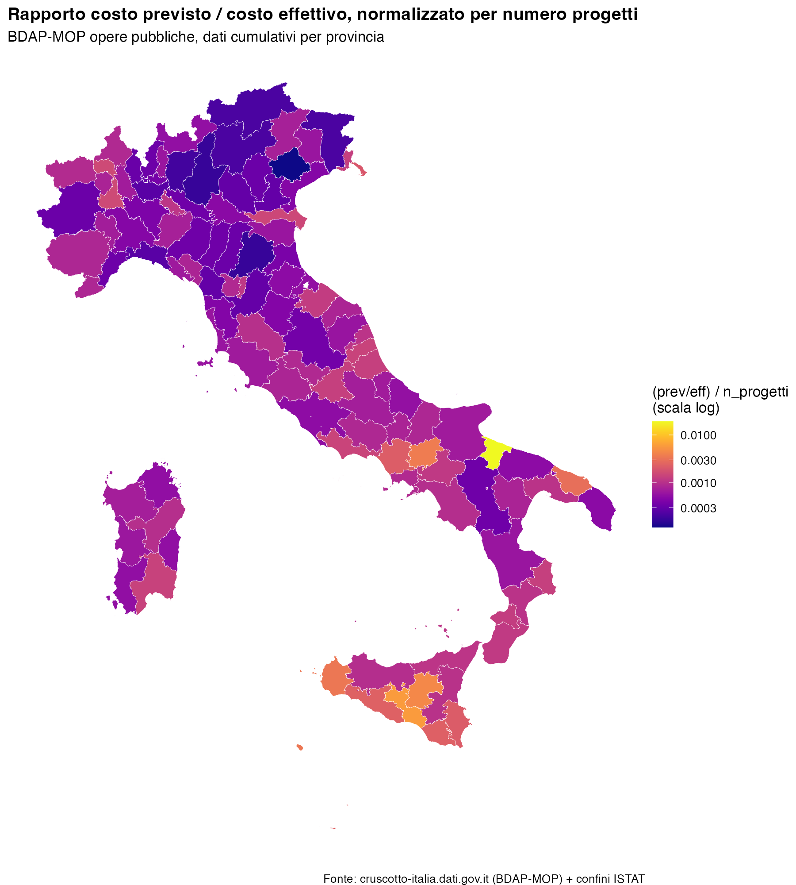

## What you will do

You will connect your AI coding assistant (Claude Code, Claude Desktop, or
ChatGPT) to a live open-data server about Italian municipalities, pull a
dataset on public works contracts, and produce a province-level map. The
point of the exercise is not the map itself — it's learning to (a) find and
query a real administrative dataset through an AI agent, and (b) think
critically about what the resulting variable actually measures before you
interpret it.

Work in pairs. Bring a laptop with Claude Code (or Claude Desktop / ChatGPT)
installed.

---

## Step 1 — Set up the MCP connection

"Cruscotto Italia" (<https://cruscotto-italia.dati.gov.it>) aggregates ~27
open datasets (ANAC, BDAP, ISTAT, SIOPE, PNRR, ...) for all 7,918 Italian
municipalities. It exposes this data to AI assistants through the **Model
Context Protocol (MCP)** — a standard that lets a chatbot call live data
tools instead of guessing from its training data.

1. Go to <https://cruscotto-italia.dati.gov.it/about.html#accesso-mcp> and
   read the "5. Accesso" section. Note the four ways the data can be
   accessed — website, ZIP download, MCP API, CLI skill — and understand
   why we want the **MCP API** for this exercise (it lets the agent query
   the data directly from natural-language requests, without you writing
   any scraping code).
2. The public MCP endpoint is:

   ```
   https://cruscotto-italia-mcp.agid.workers.dev/mcp
   ```

3. Follow the step-by-step connection guide for your tool, linked from that
   same page ("Istruzioni per Claude" / "Istruzioni per ChatGPT"). If you
   are using Claude Code, this means adding the MCP server via its
   connector settings; if you are on Claude.ai or ChatGPT, add it as a
   custom connector using the URL above.
4. Confirm the connection works before moving on: ask your agent to look up
   **any** municipality and tell you something simple about it (population,
   number of schools — anything). If it returns a real, specific number,
   the connection is live.

---

## Step 2 — Get a feel for the data

Before building the real query, practice with a **different** question so
you understand what the tool can return and how to phrase requests. For
example, try asking your agent something like:

> "Using the Cruscotto Italia data, compare the number of electric vehicle
> charging points per 1,000 inhabitants between Bologna and Padova."

Look at what comes back: does the agent tell you which underlying dataset
it used? Does it cite a source and a reference date? Does it return a
single snapshot number or a time series? This matters because the dataset
we actually want (public works costs) has similar quirks, and you should
know how to spot them.

---

## Step 3 — Define the outcome variable

The dataset we want comes from **BDAP-MOP** (public works projects reported
to the Ragioneria Generale dello Stato). Each project carries a *planned
cost* ("costo previsto") recorded at approval, and an *actual cost* ("costo
effettivo") recorded as money is spent/accounted for. Our outcome variable,
for each Italian **province**, is:

$$
\text{outcome}_p = \frac{1}{N_p}\left(\frac{\text{costo previsto}_p}{\text{costo effettivo}_p}\right)
$$

i.e. the ratio of total planned to total actual cost of public works in the
province, **divided by the number of projects** $N_p$ in that province.
Dividing by $N_p$ turns a province-level sum into something closer to a
per-project measure, so that provinces with many small projects aren't
automatically different from provinces with few large ones purely
mechanically.

Think for a minute, before moving on, about what values of this ratio you
would consider "normal", and what a very high or very low value might mean.

---

## Step 4 — Ask your agent to build the map

Now ask your AI agent to produce the data and the map. Structure your
request in stages — don't ask for everything in one giant prompt. Roughly,
you want to tell your agent to:

1. **Find the right tool/dataset.** Ask it to locate, via the MCP
   connection, public-works cost data (planned vs. actual cost) for Italian
   municipalities, and to aggregate it to the province level — summing
   planned cost, actual cost, and project count per province. (Push it to
   look for a single bulk/aggregated file rather than querying thousands of
   municipalities one by one — ask it to explain which approach it's taking
   and why.)
2. **Ask clarifying questions yourself before accepting the data**,
   specifically: what time period does this cover? Is it a snapshot of
   active projects, a historical cumulative total, or a single year? (You
   will need this for Step 5.)
3. **Define the outcome variable** exactly as in Step 3, and have it save
   the resulting province-level table (province code, number of projects,
   total planned cost, total actual cost, the ratio) to a file you can
   inspect.
4. **Ask it to map the result** on a shapefile of Italian provinces, using
   a sensible color scale. Explicitly ask it to check: does one province
   dominate the color scale and wash out the rest of the map? If so, ask it
   to fix that (for example with a log scale on the fill) and explain why
   the fix is appropriate here.
5. Ask it to write the code it used (not just show you the picture) to a
   script file you can read, re-run, and hand in.

Save your final map and script in this folder.

Here is the map produced for this exercise, for reference — your version
does not need to look identical, but should show the same idea:



---

## Step 5 — Questions to answer (hand in with your map)

Answer these in a few sentences each, based on what your agent told you and
your own judgment — not just what sounds plausible.

1. **What is the time frame of these numbers?** Is "costo previsto" vs.
   "costo effettivo" measured over the same reference period for every
   project, or could you be comparing decades-old projects in one province
   to year-old projects in another? Does "cumulative since the project
   database began" mean the same thing for a province with mostly finished
   projects as for one with mostly projects still underway?

2. **Why might this outcome variable differ across provinces for reasons
   that have nothing to do with how well public money is managed?** Think
   about at least three distinct explanations — e.g., composition of
   project types (a road resurfacing vs. a rail tunnel behave very
   differently), project *status* (a project still "ATTIVO" reports
   spending-to-date, not a final cost, so it is not comparable to a
   "CHIUSO" project), scale effects (one huge outlier project can dominate
   a small province's total), and the possibility that some provinces
   simply do more or different kinds of public works.

3. **How much can we read into this variable?** If you saw that province X
   has a ratio twice as high as province Y, would you be comfortable
   concluding X is "worse" at cost control? What additional data or checks
   would you want before making that claim? What would a labor/urban
   economist want to control for before treating this as a measure of
   public-sector efficiency or corruption risk?

Be specific and refer back to what you actually observed in your own data
pull, not to BDAP-MOP data in the abstract.
